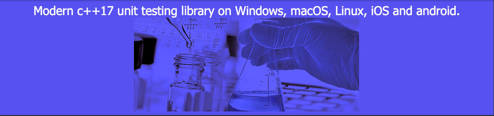

| [Home](home.md) | [Downloads](downloads.md) | [Examples](examples.md) | [Documentation](documentation.md) | [Sources](https://github.com/gammasoft71/tunit) | [Project](https://sourceforge.net/projects/tunitpro/) | [Gammasoft](https://gammasoft71.wixsite.com/gammasoft) | [Contact](contact.md) | [Website](https://gammasoft71.wixsite.com/tunit) |

# tunit

* An [xUnit](https://en.wikipedia.org/wiki/XUnit) test framework.
* A unit-testing framework for modern C++17. Initially ported from [Microsoft.VisualStudio.TestTools.Cpp](https://docs.microsoft.com/en-us/visualstudio/test/microsoft-visualstudio-testtools-cppunittestframework-api-reference).
* Auto registration of class and method based tests.
* Rich set of assertions.
* std::ostream output event listener.
* Extendable :
  * you can create your own event listener (see [create_your_own_event_listener example](../examples/create_your_own_event_listener)).
  * you can create your own assertion, validation and assume tests (see [create_your_own_event_assertion_class example](../examples/create_your_own_assertion_class)).
* Gets duration for each test, and for each class test.
* Formatted XML output of the test results (JUnit-compatible).
* CMake build script.
* Very easy to use.

______________________________________________________________________________________________

© 2021 Gammasoft.
